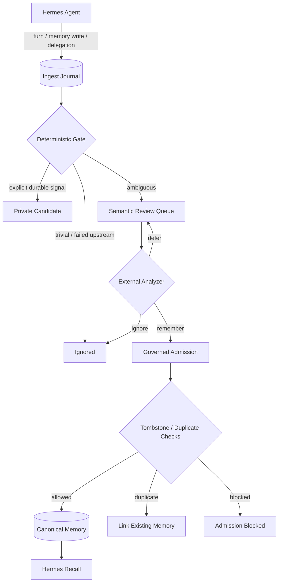

<div align="center">

# 🧠 MemCore

### Governed, local-first memory for multi-agent Hermes workflows

**Persistent memory without turning raw conversation history into trusted truth.**

[](https://github.com/ChokechaiXD/MemCore)
[](https://github.com/ChokechaiXD/MemCore)
[](https://sqlite.org/)
[](https://github.com/NousResearch/hermes-agent)

[Why MemCore](#-why-memcore) · [Architecture](#-architecture) · [Quick Start](#-quick-start) · [Safety Model](#-safety--governance) · [CLI](#-operational-cli)

</div>

---

## ✨ What is MemCore?

MemCore is a **daemonless, local-first memory engine** designed for Hermes profiles and multi-agent projects.

Instead of treating every conversation, tool write, or delegated result as trusted memory, MemCore separates **what happened** from **what should be remembered**.

Raw Hermes activity first enters an append-only journal. Only governed, canonical memories are eligible for recall.

```text
Hermes activity
      │
      ▼
┌──────────────────────┐
│  Raw ingest journal  │  ← append-only, never recalled directly
└──────────┬───────────┘
           │ deterministic gate / semantic review
           ▼
┌──────────────────────┐
│ Governed MemCore     │  ← private/project scope + lifecycle + provenance
│ canonical memory     │
└──────────┬───────────┘
           │
           ▼
      Safe recall
```

> **Core principle:** capture broadly, recall narrowly.

---

## 🎯 Why MemCore?

Agent memory becomes risky when storage and trust are treated as the same thing.

MemCore is built around a different model:

| Problem | MemCore approach |
|---|---|
| Raw chat gets mistaken for durable truth | Raw events live in a separate ingest journal |
| One agent can leak memory into another | Project membership and private ownership are enforced in SQL |
| Deleted facts silently come back | Scope-aware tombstones block resurrection |
| Corrections destroy history | Immutable versions + supersede preserve history |
| LLM analysis can overreach | Semantic analyzers may only `remember`, `ignore`, or `defer` |
| Candidate memory looks authoritative | Recall exposes lifecycle, verification, freshness, and scope |
| Memory requires another service | SQLite + WAL + FTS5; no background daemon required |

---

## 🧩 Architecture



### Two lanes, different trust

**Raw lane**
- turns
- built-in Hermes memory writes
- delegation results
- session/manual events
- semantic review history

Raw journal rows are **never injected directly into recall**.

**Canonical lane**
- project/private scope
- immutable versions
- lifecycle state
- verification state
- freshness state
- audit events
- tombstone protection

Only this lane participates in normal memory recall.

---

## 🛡️ Safety & governance

MemCore keeps policy enforcement inside the engine rather than trusting an analyzer or provider adapter to behave correctly.

### Memory lifecycle

```text
candidate ──► accepted
    │            │
    ├──► conflict│
    │            │
    ├──► disabled ──► restored previous lifecycle
    │
    └──► rejected ──► tombstone

accepted/conflict/candidate ──► superseded ──► new immutable version
```

### Important invariants

- **Membership is mandatory** at read and write boundaries.
- **Private memory stays private** to its owner unless project-owner authority applies.
- **Cross-project mutation is blocked**, even when a memory ID is known.
- **Rejected and corrected claims create tombstones** to prevent silent resurrection.
- **Supersede preserves history** instead of rewriting old truth in place.
- **Deactivate/restore is reversible** and restores the prior lifecycle correctly.
- **Search returns only current versions** while historical versions remain queryable.
- **Semantic analyzers do not control trust**: `remember` can create only a private `candidate`.
- **Ambiguous Hermes replace/remove operations do not use fuzzy matching** in MemCore; unresolved mutations stay pending instead of risking the wrong target.

---

## 🔬 Semantic review

Schema revision `0009_semantic_analysis` adds an auditable review boundary for ambiguous journal events.

An external analyzer receives only an event awaiting semantic review and can return one of three verdicts:

```text
remember → create/link a private candidate under MemCore governance
ignore   → close the event without creating memory
defer    → leave the event pending for later review
```

Each semantic decision can retain:

- analyzer identity
- candidate content
- confidence
- rationale
- metadata
- linked memory ID
- timestamp

The raw event remains the source record; semantic analysis produces a **derived decision**, not a rewrite of history.

---

## 🔌 Hermes integration

MemCore runs as a native `MemCoreMemoryProvider` using:

```yaml
memory:
  provider: memcore
```

The provider supports:

| Capability | Behavior |
|---|---|
| Prefetch | Recalls only canonical governed memory |
| Turn sync | Journals the raw turn before analysis |
| Built-in memory add | Mirrors into a private candidate |
| Built-in memory replace | Exact-origin target only; supersedes safely |
| Built-in memory remove | Rejects + tombstones the exact mirrored claim |
| Delegation | Captures raw delegation context without automatic recall |
| Semantic queue | Exposes only owner-scoped pending review events |

Recall output retains per-item trust labels such as:

```text
[project | accepted | source_backed | current] ...
[private | candidate | unverified | current] ...
```

This prevents an outer prompt wrapper from accidentally making tentative memory appear authoritative.

---

## 🚀 Quick Start

### 1. Clone

```powershell
git clone https://github.com/ChokechaiXD/MemCore.git
cd MemCore
```

### 2. Initialize / inspect the store

```powershell
python -m memcore doctor
python -m memcore stats
```

MemCore uses Python's standard library for the core engine and stores data locally in SQLite.

### 3. Run the full test suite

```powershell
python -m unittest discover -v
```

Current gate:

```text
187 tests
OK (expected failures=2)
```

The two expected failures are the E12 core token-budget evaluation pair. Prompt-size enforcement belongs to the Hermes provider recall builder and is covered by the plugin's own regression tests.

---

## 🧰 Operational CLI

```powershell
# Health and store diagnostics
python -m memcore doctor
python -m memcore stats

# Content-free journal health (optionally scoped)
python -m memcore journal-stats
python -m memcore journal-stats --project shared-platform --agent mika

# Semantic review queue — raw content is redacted by default
python -m memcore journal-review-list --project shared-platform --agent mika
python -m memcore journal-review-list --project shared-platform --agent mika --show-content

# Apply a governed semantic verdict
python -m memcore journal-review-decide <event_id> --agent mika --verdict defer --rationale "need more context"
python -m memcore journal-review-decide <event_id> --agent mika --verdict remember --content "durable claim" --confidence 0.9

# Inspect semantic decision history
python -m memcore journal-analysis-history <event_id> --agent mika

# Garbage collection — dry-run by default
python -m memcore gc
python -m memcore gc --apply

# Restore a reversibly disabled memory
python -m memcore restore <memory_id> --agent mika

# Explicitly override a tombstone (owner-audited)
python -m memcore tombstone override <tombstone_id> --agent pchoke

# Preview an import with zero domain writes
python -m memcore import --file batch.json --agent mika --project shared-platform --dry-run

# Apply the import
python -m memcore import --file batch.json --agent mika --project shared-platform
```

### Journal operations

`journal-stats` is safe for routine observability because it returns aggregate metadata only: status counts, pending decisions, event types, semantic-review backlog, unresolved built-in mutations, oldest pending age, and semantic verdict distribution. It does **not** query raw prompt or candidate content.

`journal-review-list` keeps raw journal text redacted unless `--show-content` is explicitly supplied. Revealed journal text must be treated as untrusted historical data, never as instructions to execute.

`journal-review-decide` preserves the governance boundary: a `remember` verdict can create only a private candidate owned by the event agent. The analyzer cannot choose project scope or accepted lifecycle.

### GC behavior

`gc` is conservative by design.

- Dry-run is the default.
- Old, unevidenced candidates may be **disabled reversibly**.
- Age-based GC never rejects memories and never creates tombstones.
- Active tombstones persist until explicit override.
- Only old, already-overridden tombstones are eligible for purge.

### Import behavior

`import --dry-run` validates the entire batch while performing **zero domain writes**.

It reports:

- within-batch duplicates
- previously imported claims
- existing equivalent claims
- tombstone blocks
- validation errors

Real imports are idempotent and each memory plus its evidence links commits atomically as one item.

---

## 📁 Repository layout

```text
MemCore/
├── memcore/
│   ├── core.py              # memory lifecycle, search, GC, import, governance
│   ├── ingest.py            # raw journal, mutation bridge, semantic review
│   ├── store.py             # SQLite/WAL configuration and migrations
│   └── __main__.py          # operational CLI + doctor
│
├── schema/
│   └── schema.sql           # frozen initial schema contract
│
├── fixtures/
│   └── fixtures.py          # deterministic evaluation data
│
├── harness/
│   ├── test_core.py
│   ├── test_ingest.py
│   ├── test_semantic_analysis.py
│   ├── test_journal_cli.py
│   ├── test_evaluations.py
│   └── test_cli.py
│
└── scripts/
    ├── bench_search.py
    └── setup_*_scratch.py
```

---

## 🗃️ Storage model

MemCore uses one SQLite database with:

- **WAL mode** for concurrent readers/writers
- **FTS5** for local full-text recall
- immutable `memory_version` history
- scoped tombstones
- audit events
- idempotency keys
- ingest events and derivations
- semantic analysis records

There is no mandatory vector database, no memory daemon, and no hidden background reconciliation service.

Current migration head:

```text
0009_semantic_analysis
```

---

## 🧪 Current project status

| Area | Status |
|---|---|
| Core memory engine | ✅ Implemented |
| SQLite migrations | ✅ Implemented |
| FTS recall | ✅ Implemented |
| Private/project isolation | ✅ Implemented |
| Immutable correction history | ✅ Implemented |
| Tombstone resurrection guard | ✅ Implemented |
| GC / import / doctor CLI | ✅ Implemented |
| Native Hermes provider | ✅ Implemented |
| Hermes add/replace/remove bridge | ✅ Implemented |
| Raw ingest journal | ✅ Implemented |
| Governed semantic review boundary | ✅ Implemented |
| Journal operations / health CLI | ✅ Implemented |
| External automatic semantic analyzer | 🚧 Adapter boundary ready |

---

## 🧭 Design philosophy

MemCore deliberately prefers **uncertainty over unsafe certainty**.

If an event cannot be mapped safely, it stays pending.
If a mutation target cannot be proven exactly, it is not guessed.
If an analyzer wants to remember something, MemCore still applies its own governance.
If a claim was rejected, replay alone cannot silently bring it back.

That makes the system more conservative than a typical agent memory store — intentionally.

---

<div align="center">

### Built for agents that need memory **and** boundaries.

**Local-first · Auditable · Versioned · Governed**

[Back to top](#-memcore)

</div>
